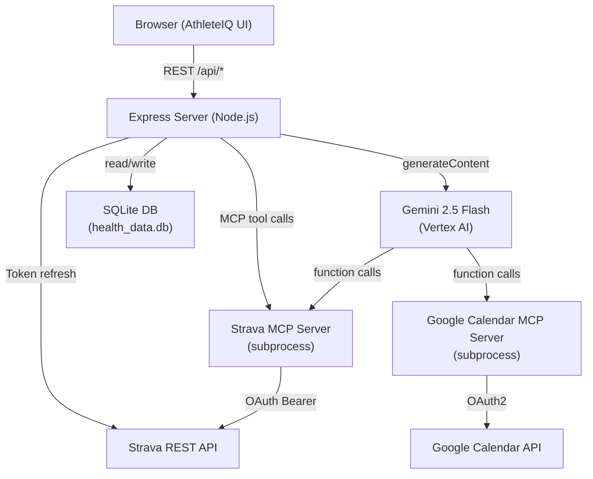
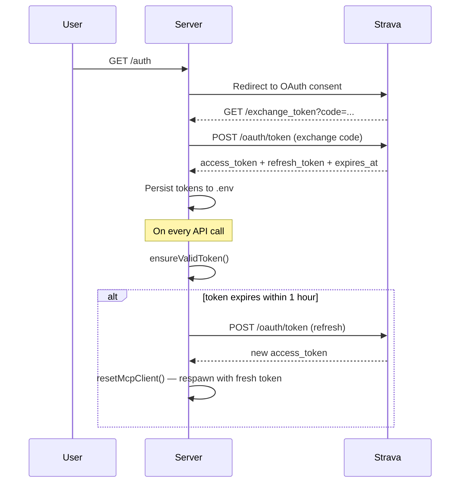
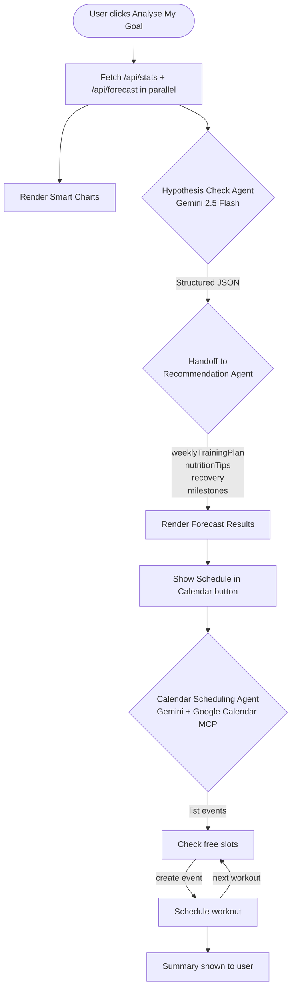
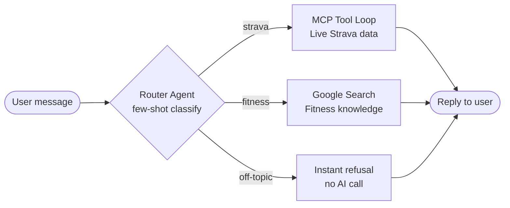

# AthleteIQ

> AI-powered Strava health analyser with goal forecasting, personalised training plans, and Google Calendar scheduling — powered by Gemini 2.5 Flash.

---

## Features

- **Live Strava data** via Strava MCP — activities, stats, athlete profile
- **Smart Charts** — distance trend, pace trend, weekly volume, heart rate distribution, activity types, efficiency
- **Goal Forecast** — hypothesis check agent validates your goal against real data, then a recommendation agent builds a personalised plan with handoff
- **AI Chat** — intent-routed assistant: Strava questions use live MCP tool calls, fitness questions use Google Search, off-topic is refused
- **Google Calendar scheduling** — AI agent finds free slots and schedules workouts automatically

---

## Architecture



---

## OAuth & Token Flow



---

## AI Agent Flow



---

## Chat Intent Routing



---

## Setup

### 1. Clone & install

```bash
git clone https://github.com/bhuvighosh3/HealthAnalyser.git
cd HealthAnalyser
npm install
```

### 2. Environment variables

Create a `.env` file:

```env
STRAVA_CLIENT_ID=your_strava_client_id
STRAVA_CLIENT_SECRET=your_strava_client_secret
STRAVA_ACCESS_TOKEN=
STRAVA_REFRESH_TOKEN=
STRAVA_EXPIRES_AT=
GCP_PROJECT_ID=your_gcp_project_id
GCP_LOCATION=us-central1
GOOGLE_OAUTH_CREDENTIALS=/path/to/gcp-oauth.keys.json   # optional — for Calendar
```

### 3. Strava OAuth

```bash
npm start
# Visit http://localhost:3000/auth
```

### 4. Google Calendar (optional)

1. Create an OAuth 2.0 Desktop client in [Google Cloud Console](https://console.cloud.google.com)
2. Enable the Google Calendar API
3. Create `gcp-oauth.keys.json`:

```json
{
  "installed": {
    "client_id": "YOUR_CLIENT_ID",
    "client_secret": "YOUR_CLIENT_SECRET",
    "redirect_uris": ["urn:ietf:wg:oauth:2.0:oob", "http://localhost"],
    "auth_uri": "https://accounts.google.com/o/oauth2/auth",
    "token_uri": "https://oauth2.googleapis.com/token"
  }
}
```

4. Set `GOOGLE_OAUTH_CREDENTIALS=/absolute/path/to/gcp-oauth.keys.json` in `.env`
5. Run first-time auth:

```bash
npx @cocal/google-calendar-mcp auth
```

### 5. Run

```bash
npm start
# http://localhost:3000
```

---

## Tech Stack

| Layer | Technology |
|---|---|
| Frontend | Vanilla JS, Chart.js 4, Lucide icons |
| Backend | Node.js, Express |
| AI | Google Gemini 2.5 Flash via Vertex AI (`@google/genai`) |
| Strava data | Strava REST API + `strava-mcp-server` |
| Calendar | `@cocal/google-calendar-mcp` |
| MCP bridge | `@modelcontextprotocol/sdk` + `mcpToTool()` |
| Database | SQLite (`better-sqlite3`) |

---

## Project Structure

```
├── controllers/
│   ├── aiController.js        # Chat with intent routing
│   ├── forecastController.js  # Hypothesis + Recommendation agents
│   ├── scheduleController.js  # Google Calendar scheduling agent
│   └── stravaController.js    # Strava data endpoints
├── services/
│   ├── aiService.js           # Gemini client singleton
│   ├── calendarMcpService.js  # Google Calendar MCP client
│   ├── mcpService.js          # Strava MCP client
│   └── stravaService.js       # Token refresh + Strava REST
├── routes/
│   └── apiRoutes.js
├── db/
│   └── database.js
├── public/
│   ├── index.html
│   ├── app.js
│   └── styles.css
└── server.js
```
