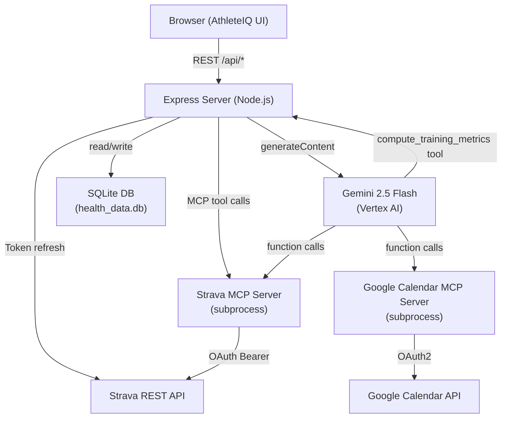
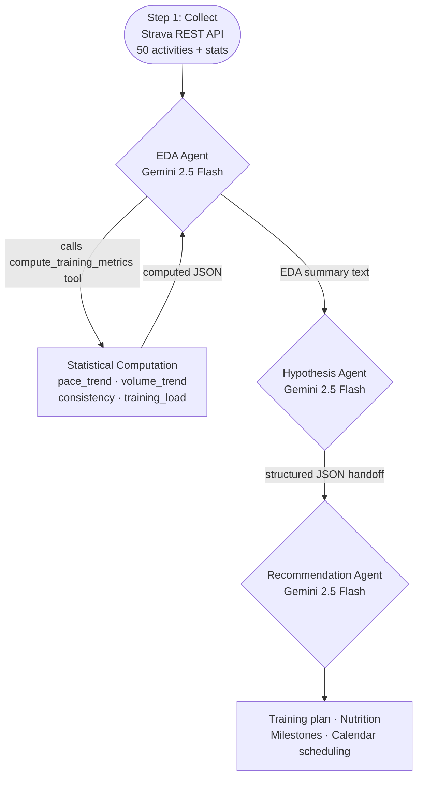
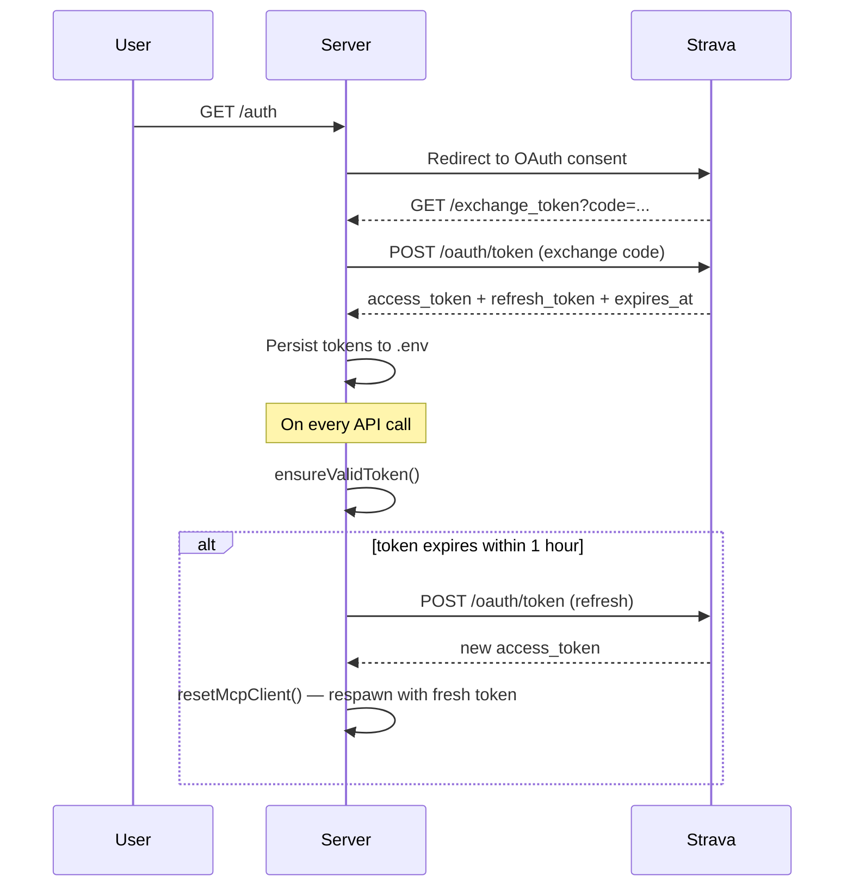

# AthleteIQ

> AI-powered Strava health analyser — collects real training data, performs statistical EDA, hypothesises goal feasibility, and delivers personalised plans. Powered by Gemini 2.5 Flash + Google Calendar MCP.

**Live:** https://athleteiq-290375529887.us-central1.run.app

---

## Collect → EDA → Hypothesize Pipeline

### Step 1: Collect
**File:** `controllers/forecastController.js` — top of `exports.forecast`

At runtime, the agent fetches from the Strava REST API:
- `/athlete/activities?per_page=50` — full activity history (distance, pace, HR, elevation, suffer score)
- `/athlete` — athlete profile
- `/athletes/:id/stats` — all-time and YTD aggregates

Data is real, live, and non-trivial (full athlete training history). It is also enriched server-side with MET-based calorie estimates per activity type.

### Step 2: Explore and Analyse (EDA)
**File:** `controllers/forecastController.js` — **EDA Agent** section, `computeTrainingMetrics()` function

A dedicated **EDA Agent** (Gemini 2.5 Flash) calls the `compute_training_metrics` tool which executes deterministic statistical computations over the collected Strava data:

| Metric | What it computes |
|---|---|
| `pace_trend` | Linear regression slope over all runs — direction (improving/stable/regressing), avg, fastest, slowest |
| `volume_trend` | Weekly distance aggregation, avg vs recent volume, peak week, 6-week breakdown |
| `consistency` | Weeks active in last 4, avg days between runs, longest gap, consistency % |
| `training_load` | Avg session duration, avg run distance, avg HR, avg suffer score |

Gemini calls the tool with `metric='all'`, receives the computed JSON, and writes a natural-language EDA report citing the specific numbers. This EDA summary is passed as grounded context to the Hypothesis Agent.

### Step 3: Hypothesize
**File:** `controllers/forecastController.js` — **Hypothesis Check Agent** section

The Hypothesis Agent receives the EDA findings + raw activities + user profile and produces a structured JSON hypothesis:
- `feasibility`: achievable / challenging / unrealistic
- `feasibilityScore`: 0–100
- `projections`: weeks to goal, expected progress by deadline, total kcal burned
- `assumptions`, `gaps`, `riskFactors`
- `summary`: 2–3 sentences grounded in the EDA data

This is then handed off to the **Recommendation Agent** which generates the full training plan, nutrition tips, milestones, and weekly targets.

---

## Architecture



---

## Multi-Agent Pipeline



---

## Concept Checklist

### Required
| Concept | Status | Location |
|---|---|---|
| Frontend | ✅ | `public/index.html`, `public/app.js` |
| Agent framework | ✅ | `@google/genai` v1.49 with agentic tool-call loops |
| Tool calling | ✅ | `compute_training_metrics` (EDA), Strava MCP, Calendar MCP |
| Non-trivial dataset | ✅ | Strava activities API — real training history, fetched at runtime |
| Multi-agent pattern | ✅ | EDA → Hypothesis → Recommendation (3-agent handoff) |
| Deployed | ✅ | Google Cloud Run — https://athleteiq-290375529887.us-central1.run.app |
| README | ✅ | This file |

### Grab-Bag (≥2 required — we have 4)
| Concept | Status | Location |
|---|---|---|
| Structured output | ✅ | Hypothesis JSON + Recommendation JSON with strict schemas |
| Data visualization | ✅ | Chart.js — distance, pace, weekly volume, HR zones, efficiency |
| Second data retrieval | ✅ | Google Search grounding in chat (`{ googleSearch: {} }`) |
| Iterative refinement loop | ✅ | Chat MCP loop (5 rounds), EDA tool loop (3 rounds), Calendar loop (10 rounds) |

---

## OAuth & Token Flow



---

## Chat Intent Routing


---

## Setup

### 1. Clone & install
```bash
git clone https://github.com/bhuvighosh3/HealthAnalyser.git
cd HealthAnalyser
npm install   # postinstall automatically patches strava-mcp-server weight field
```

### 2. Environment variables — `.env`
```env
STRAVA_CLIENT_ID=...
STRAVA_CLIENT_SECRET=...
STRAVA_ACCESS_TOKEN=
STRAVA_REFRESH_TOKEN=
STRAVA_EXPIRES_AT=
GCP_PROJECT_ID=your_gcp_project
GCP_LOCATION=us-central1
GOOGLE_OAUTH_CREDENTIALS=/absolute/path/to/gcp-oauth.keys.json  # optional
```

### 3. Strava OAuth
```bash
npm start
# Visit http://localhost:3000/auth
```

### 4. Google Calendar (optional)
Create `gcp-oauth.keys.json` with your OAuth 2.0 Desktop credentials, set `GOOGLE_OAUTH_CREDENTIALS` in `.env`, then:
```bash
GOOGLE_OAUTH_CREDENTIALS=/path/to/gcp-oauth.keys.json npx @cocal/google-calendar-mcp auth
```

### 5. Run
```bash
npm start  # http://localhost:3000
```

---

## Tech Stack

| Layer | Technology |
|---|---|
| Frontend | Vanilla JS, Chart.js 4, Lucide icons |
| Backend | Node.js, Express |
| AI | Google Gemini 2.5 Flash via Vertex AI (`@google/genai`) |
| Strava data | Strava REST API + `strava-mcp-server` |
| Calendar | `@cocal/google-calendar-mcp` |
| MCP bridge | `@modelcontextprotocol/sdk` + `mcpToTool()` |
| Database | SQLite (`sqlite3`) |

---

## Project Structure

```
├── controllers/
│   ├── aiController.js        # Chat with intent routing + MCP fallback
│   ├── forecastController.js  # EDA → Hypothesis → Recommendation agents
│   ├── scheduleController.js  # Google Calendar scheduling agent
│   └── stravaController.js    # Strava data endpoints + computed stats
├── services/
│   ├── aiService.js           # Gemini client singleton
│   ├── calendarMcpService.js  # Google Calendar MCP client
│   ├── mcpService.js          # Strava MCP client (with weight patch)
│   └── stravaService.js       # Token refresh + Strava REST
├── scripts/
│   └── postinstall.js         # Patches strava-mcp-server weight field after npm install
├── routes/
│   └── apiRoutes.js
├── db/
│   └── database.js
├── public/
│   ├── index.html
│   ├── app.js
│   └── styles.css
└── server.js
```
