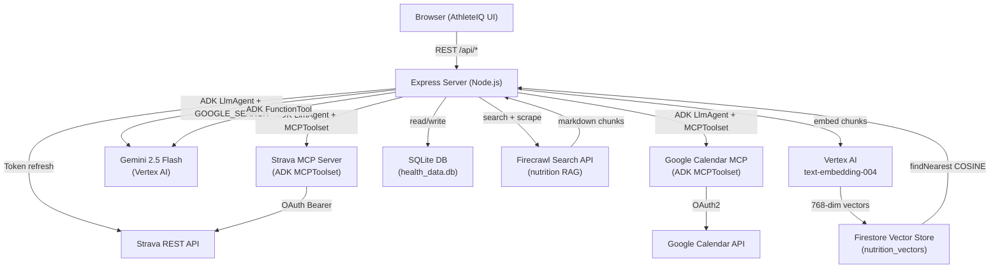
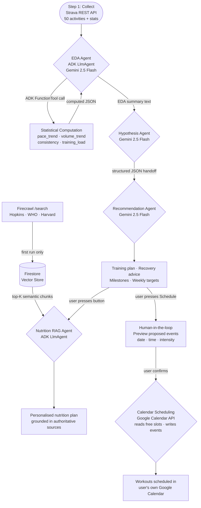
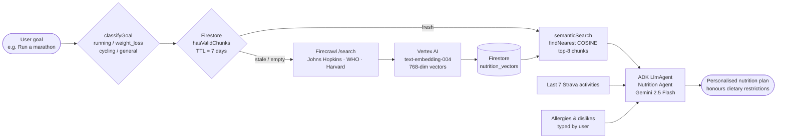
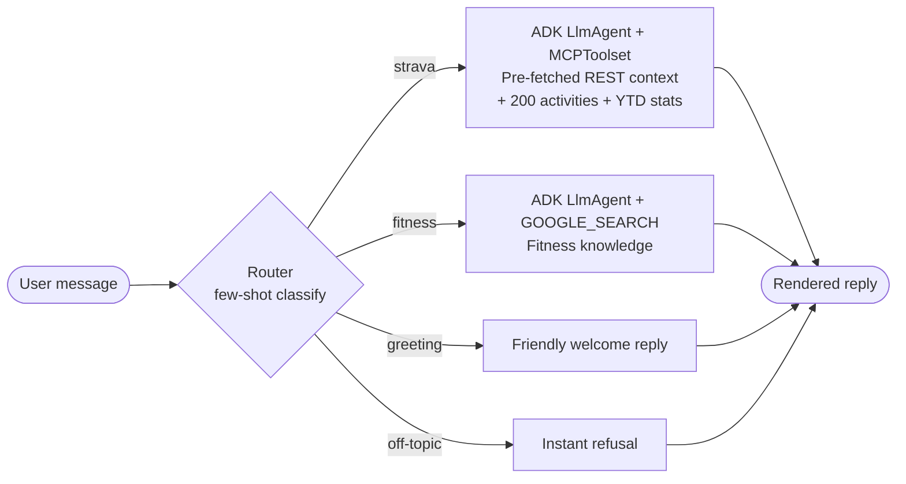
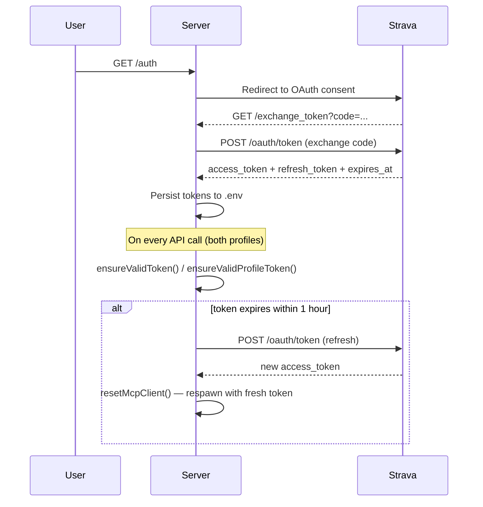

# AthleteIQ

> AI-powered Strava health analyser — collects real training data, performs statistical EDA, hypothesises goal feasibility, delivers personalised training plans, and generates RAG-grounded nutrition guidance via a dedicated agent. Powered by Google ADK (Gemini 2.5 Flash + Vertex AI).

**Live:** https://athleteiq-290375529887.us-central1.run.app

---

## Collect → EDA → Hypothesize Pipeline

### Step 1: Collect
**File:** `controllers/forecastController.js` — top of `exports.forecast`

At runtime, the agent fetches from the Strava REST API:
- `/athlete/activities?per_page=200` — full activity history (distance, pace, HR, elevation, suffer score)
- `/athlete` — athlete profile
- `/athletes/:id/stats` — all-time and YTD aggregates

Data is real, live, and non-trivial (full athlete training history). It is also enriched server-side with MET-based calorie estimates per activity type.

### Step 2: Explore and Analyse (EDA)
**File:** `controllers/forecastController.js` — **EDA Agent** section, `computeTrainingMetrics()` function

A dedicated **EDA Agent** (`LlmAgent` via Google ADK) calls the `compute_training_metrics` `FunctionTool` which executes deterministic statistical computations over the collected Strava data:

| Metric | What it computes |
|---|---|
| `pace_trend` | Linear regression slope over all runs — direction (improving/stable/regressing), avg, fastest, slowest |
| `volume_trend` | Weekly distance aggregation, avg vs recent volume, peak week, 6-week breakdown |
| `consistency` | Weeks active in last 4, avg days between runs, longest gap, consistency % |
| `training_load` | Avg session duration, avg run distance, avg HR, avg suffer score |

The ADK agent calls the tool with `metric='all'`, receives the computed JSON, and writes a natural-language EDA report citing the specific numbers. This EDA summary is passed as grounded context to the Hypothesis Agent.

### Step 3: Hypothesize
**File:** `controllers/forecastController.js` — **Hypothesis Check Agent** section

The Hypothesis Agent receives the EDA findings + raw activities + user profile and produces a structured JSON hypothesis:
- `feasibility`: achievable / challenging / unrealistic
- `feasibilityScore`: 0–100
- `projections`: weeks to goal, expected progress by deadline, total kcal burned
- `assumptions`, `gaps`, `riskFactors`
- `summary`: 2–3 sentences grounded in the EDA data

This is then handed off to the **Recommendation Agent** which generates a personalised training plan, recovery advice, milestones, and weekly targets.

> **Note:** Nutrition advice is intentionally excluded from the Recommendation Agent — it is handled by the dedicated **AI Nutrition Agent** (see below).

---

## Architecture



---

## Multi-Agent Pipeline



---

## Concept Checklist

### Required
| Concept | Status | Location |
|---|---|---|
| Frontend | ✅ | `public/index.html`, `public/app.js` |
| Agent framework | ✅ | **Google ADK** (`@google/adk`) — `LlmAgent`, `FunctionTool`, `MCPToolset`, `GOOGLE_SEARCH` |
| Tool calling | ✅ | `compute_training_metrics` FunctionTool (EDA), Strava MCPToolset, Calendar MCPToolset |
| Non-trivial dataset | ✅ | Strava activities API — real training history, fetched at runtime |
| Multi-agent pattern | ✅ | EDA → Hypothesis → Recommendation (3-agent handoff) + separate Nutrition RAG Agent |
| Deployed | ✅ | Google Cloud Run — https://athleteiq-290375529887.us-central1.run.app |
| README | ✅ | This file |

### Grab-Bag (≥2 required — we have 6)
| Concept | Status | Location |
|---|---|---|
| Structured output | ✅ | Hypothesis JSON + Recommendation JSON with strict schemas |
| Data visualization | ✅ | Chart.js — distance, pace, weekly volume, HR zones, efficiency |
| Second data retrieval | ✅ | Google Search grounding (fitness chat) + Firecrawl search (nutrition RAG) |
| Iterative refinement loop | ✅ | ADK `runAgent` event loop; EDA FunctionTool; Calendar MCPToolset multi-round |
| RAG | ✅ | Firecrawl → Vertex AI embeddings → Firestore vector store → `findNearest` semantic search → Nutrition Agent |
| Login / multi-account | ✅ | Login page with own-credentials mode and three sample profiles (Bhuvi, Rishit, Ritwik) with real data |
| Human-in-the-loop | ✅ | Google Calendar scheduling — reads free slots, creates events in user's own calendar via per-user OAuth |

---

## Login Page

The app starts with a login screen (`/login.html`) offering two modes:

| Mode | Description |
|---|---|
| **My Account** | Enter your own Strava Client ID, Client Secret, Access Token, and Refresh Token. The server switches to your account live. |
| **Sample Profile 1 — Bhuvi** | Real Strava data — no setup needed. |
| **Sample Profile 2 — Rishit** | Real Strava data — no setup needed. |
| **Sample Profile 3 — Ritwik** | Real Strava data — no setup needed. |

Session is stored in `sessionStorage` (clears on browser/tab close — login required on every fresh session). A **Logout** button in the header clears the session and returns to login.

---

## Nutrition RAG Pipeline



Chunks are crawled **once per 7 days per goal category** and stored in Firestore with Vertex AI vector embeddings. Subsequent requests skip the crawl entirely and go straight to semantic search.

### Dietary Preferences

Before generating the plan the user can optionally enter:
- **Allergies** — foods the agent must never suggest (e.g. `peanuts, shellfish, lactose`)
- **Dislikes** — foods to avoid entirely, not even as alternatives (e.g. `tofu, beets`)

These are collected **after** the RAG retrieval runs (so they do not affect which chunks are retrieved) and injected into the agent instruction alongside the RAG context. The agent receives an explicit hard constraint: *never suggest allergenic foods; omit disliked foods entirely*.

---

## Google Calendar Scheduling

```mermaid
flowchart LR
    USER([User]) -->|1. Pick start date & weeks| UI[Calendar Section]
    UI -->|2. Connect Google Calendar| OAUTH[Google OAuth Popup]
    OAUTH -->|3. User signs in with own Google account| GOOGLE[Google Consent Screen]
    GOOGLE -->|4. Auth code| CB[/auth/google-calendar/callback]
    CB -->|5. Store tokens in Firestore gcal_sessions| FS[(Firestore)]
    UI -->|6. Schedule Workouts| API[POST /api/calendar/schedule]
    API -->|7. Read existing events| GCAL[Google Calendar API]
    GCAL -->|8. Busy times| API
    API -->|9. Find free slots 6:30am · 5:30pm · 7am · 6pm| SLOTS[Slot finder]
    SLOTS -->|10. Create events in free slots| GCAL
    GCAL --> RESULT([Workouts added to user's calendar])
```

- Each user connects their **own** Google account — events go to their calendar, not the app owner's
- Sessions stored in Firestore (`gcal_sessions`) — survive page refreshes and server restarts
- Only schedules at reasonable hours: 6:30am, 5:30pm, 7:00am, 6:00pm — no odd night times
- Reads existing events first to avoid double-booking

---

## Chat Intent Routing



Chat replies render markdown (bold, bullets, headings) as formatted HTML in the chat bubble.

---

## OAuth & Token Flow



---

## Setup

### 1. Clone & install
```bash
git clone https://github.com/bhuvighosh3/HealthAnalyser.git
cd HealthAnalyser
npm install   # postinstall automatically patches strava-mcp-server weight field
```

### 2. Environment variables — `.env`
```env
# Sample Profile 1 — Bhuvi's Strava account
BHUVI_CLIENT_ID=...
BHUVI_CLIENT_SECRET=...
BHUVI_ACCESS_TOKEN=
BHUVI_REFRESH_TOKEN=
BHUVI_EXPIRES_AT=

# Sample Profile 2 — Rishit's Strava account
RISHIT_CLIENT_ID=...
RISHIT_CLIENT_SECRET=...
RISHIT_ACCESS_TOKEN=
RISHIT_REFRESH_TOKEN=
RISHIT_EXPIRES_AT=

# Sample Profile 3 — Ritwik's Strava account
RITWIK_CLIENT_ID=...
RITWIK_CLIENT_SECRET=...
RITWIK_ACCESS_TOKEN=
RITWIK_REFRESH_TOKEN=
RITWIK_EXPIRES_AT=

GCP_PROJECT_ID=your_gcp_project
GCP_LOCATION=us-central1
GOOGLE_OAUTH_CREDENTIALS=/absolute/path/to/gcp-oauth.keys.json  # optional (Calendar)
FIRECRAWL_API_KEY=fc-...                                          # for Nutrition RAG
```

### 3. Strava OAuth
```bash
npm start
# Sample Profile 1 (Bhuvi):  http://localhost:3000/auth
# Sample Profile 2 (Rishit): http://localhost:3000/auth?profile=rishit
# Sample Profile 3 (Ritwik): http://localhost:3000/auth?profile=ritwik
```

### 4. Google Calendar (per-user OAuth)
Create a **Web Application** OAuth 2.0 client in [Google Cloud Console → APIs & Services → Credentials](https://console.cloud.google.com/apis/credentials).

Add these redirect URIs:
```
http://localhost:3000/auth/google-calendar/callback
https://<your-cloud-run-url>/auth/google-calendar/callback
```

Add to `.env`:
```env
GOOGLE_CLIENT_ID=<web client id>
GOOGLE_CLIENT_SECRET=<web client secret>
GOOGLE_REDIRECT_URI=https://<your-cloud-run-url>/auth/google-calendar/callback
```

Publish the OAuth app (APIs & Services → OAuth consent screen → Audience → Publishing status → In production) so any Google account can connect.

Each user clicks **Connect Google Calendar** in the app → authenticates with their own Google account → workouts are scheduled into **their** calendar. Sessions are stored in Firestore (`gcal_sessions` collection) and survive page refreshes and server restarts.

### 5. GCP Firestore (vector store for Nutrition RAG)
```bash
gcloud services enable firestore.googleapis.com --project <PROJECT>
gcloud firestore databases create --location=us-central1 --project <PROJECT>
# Vector index (run once — takes ~5 min)
gcloud firestore indexes composite create \
  --collection-group=nutrition_vectors \
  --query-scope=COLLECTION \
  --field-config=field-path=goalCategory,order=ASCENDING \
  --field-config=field-path=embedding,vector-config='{"dimension":768,"flat":{}}' \
  --project=<PROJECT>
```

### 6. Run
```bash
npm start  # http://localhost:3000
```

---

## Tech Stack

| Layer | Technology |
|---|---|
| Frontend | Vanilla JS, Chart.js 4, Lucide icons |
| Backend | Node.js, Express 5 |
| AI / Agents | **Google ADK** (`@google/adk` v0.6.1) — `LlmAgent`, `FunctionTool`, `MCPToolset`, `GOOGLE_SEARCH` |
| Model | Gemini 2.5 Flash via Vertex AI |
| Strava data | Strava REST API + `@r-huijts/strava-mcp-server` (ADK MCPToolset) |
| Calendar | `@cocal/google-calendar-mcp` (ADK MCPToolset) |
| Nutrition RAG | Firecrawl `/search` → Vertex AI `text-embedding-004` → Firestore vector store → `findNearest` COSINE search |
| Vector DB | Google Firestore (`nutrition_vectors` collection, 768-dim vectors) |
| Database | SQLite (`sqlite3`) — activity cache |
| Deployment | Google Cloud Run (`healthmonitor-493021`, `us-central1`) |
